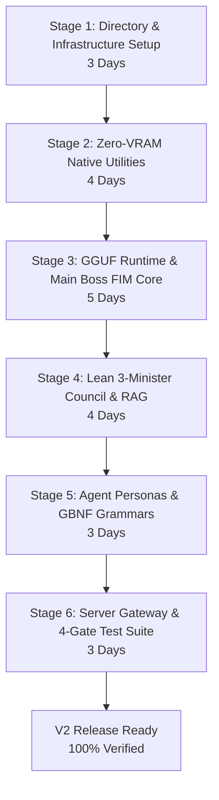

# Milestone Plan: Kingdom AI Server V2 Architecture

This document defines the **Stage-by-Stage Implementation Roadmap, Deliverables, Time Estimates, and Verification Gates** for transitioning Kingdom AI Server from the V1 ONNX 8-Minister setup to the **V2 Autonomous Enterprise Engine** (`llama.cpp` GGUF runtime, Lean 3-Minister Council, Main Boss FIM Autocomplete, and Zero-VRAM Native Utilities).

---

## Executive Overview & Timeline Summary

| Stage | Phase Description | Key Deliverables | Estimated Time |
| :--- | :--- | :--- | :--- |
| **Stage 1** | **Directory & Infrastructure Setup** | Package reorganization, GGUF/DirectML dependency pin, YAML configs | 3 Working Days |
| **Stage 2** | **Zero-VRAM Native Utilities** | Tree-sitter AST parser, manifest linter, regex security scanner, rule router | 4 Working Days |
| **Stage 3** | **GGUF Runtime & Main Boss FIM Core** | `llama.cpp` DirectML engine, `Qwen2.5-Coder-1.5B` GGUF, dual priority queue | 5 Working Days |
| **Stage 4** | **Lean 3-Minister Council & RAG** | BGE Embedder, BGE Re-Ranker, `sqlite-vec` integration, SDXS-512 Vision engine | 4 Working Days |
| **Stage 5** | **Agent Personas & GBNF Grammars** | Git Craftsman, Diff Realigner, Security Auditor, GBNF logit sampling | 3 Working Days |
| **Stage 6** | **Server Gateway, Security & Audit Gates** | FastAPI loopback server, CSPA defense, Zscaler truststore, 4-Gate test suite | 3 Working Days |
| **TOTAL** | **Full V2 Production Rollout** | **End-to-End Enterprise AI Server V2** | **22 Working Days (~4.5 Weeks)** |

---

## Detailed Stage-by-Stage Implementation Plan



---

### Stage 1: Directory Restructuring & Foundation Setup
**Estimated Time:** 3 Working Days  
**Goal:** Establish clean modular project layout (`src/`, `config/`, `data/`, `scripts/`) and pin GGUF runtime dependencies.

#### Task Breakdown & Deliverables
1. **Directory Restructuring:**
   - Migrate source files to standardized structure (`src/core/`, `src/prompts/`, `src/rag/`, `src/processing/`, `src/inference/`).
   - Create data directories (`data/cache/`, `data/embeddings/`, `data/vectordb/`).
2. **Dependency Configuration (`requirements.txt` & `pyproject.toml`):**
   - Pin `llama-cpp-python` (with DirectML & CPU AVX2 backends).
   - Pin `onnxruntime-directml>=1.15.0`, `tree-sitter>=0.20.0`, `fastapi`, `uvicorn`, `truststore`.
3. **YAML Configuration Engine (`config/`):**
   - Implement `config/model_config.yaml` declaring GGUF quantization specs, DirectML device IDs, and KV-cache bounds.
   - Implement `config/logging_config.yaml` for rotating file handlers and audit filters.

#### Verification Gate
- `python -c "import llama_cpp; import tree_sitter; import truststore; print('Stage 1 Dependencies OK')"` exits cleanly.

---

### Stage 2: Zero-VRAM Native Utility Layer
**Estimated Time:** 4 Working Days  
**Goal:** Offload deterministic syntax parsing, dependency checking, security regex scanning, and rule-based intent routing to native libraries (<3 ms, 0 MB VRAM).

#### Task Breakdown & Deliverables
1. **Tree-sitter Native Structural Chunker (`src/processing/chunking.py`):**
   - Implement C-ABI bindings for Python, TypeScript, Go, Rust, and C++.
   - Extract AST functions, class boundaries, imports, and LOC in <1 ms with <5 MB RAM.
2. **Manifest & Import Set-Lookup Validator (`src/processing/preprocessor.py`):**
   - Parse `package.json`, `requirements.txt`, `Cargo.toml`, and `go.mod`.
   - Perform $O(1)$ set-intersection check on generated code imports to intercept hallucinated modules (<2 ms).
3. **Compiled RegEx & Vulnerability Scanner (`src/processing/preprocessor.py`):**
   - Implement static pattern matcher for hardcoded API keys, raw SQL string concatenations, innerHTML assignments, and shell sinks (`os.system`, `eval`) (<3 ms).
4. **AST-Guided Structural Trimmer & Heuristic Router (`src/prompts/templates.py`):**
   - Strip redundant whitespace, docstrings, and elide function bodies (`// ... elided`).
   - Implement Prefix & Rule-Based Intent Router for IDE shortcut matching (`@workspace`, `/fix`, `/explain`) in 0.01 ms.

#### Verification Gate
- Native benchmark suite verifies Tree-sitter AST parsing <1 ms and static import checking <2 ms.

---

### Stage 3: GGUF Runtime Core & Main Boss FIM Autocomplete
**Estimated Time:** 5 Working Days  
**Goal:** Replace ONNX GenAI with `llama.cpp` GGUF engine and enable single-model Fill-in-the-Middle (FIM) tab completions (<35 ms).

#### Task Breakdown & Deliverables
1. **GGUF Execution Orchestrator (`src/core/local_llm.py` & `model_factory.py`):**
   - Build `LlamaCppOrchestrator` supporting DirectML GPU acceleration with automatic CPU AVX2 fallback.
   - Auto-provision `Qwen2.5-Coder-1.5B-Instruct` Q4_K_M GGUF model (~1.1 GB).
2. **Fill-In-the-Middle (FIM) Sentinel Formatting (`src/processing/tokenizer.py`):**
   - Format FIM tokens: `<|fim_prefix|>` + Prefix + `<|fim_suffix|>` + Suffix + `<|fim_middle|>`.
   - Implement greedy sampling ($\text{temperature} = 0.0$), max 32 tokens, stopping at newline (`\n`).
3. **Dual-Worker Priority Queue (`src/inference/inference_engine.py`):**
   - Implement preemptive priority scheduler prioritizing `/v1/completions` FIM requests over background chat streams.
   - Achieve time-to-first-token (TTFT) in 20–35 ms for fluid inline IDE ghost text.

#### Verification Gate
- Automated benchmark confirms `/v1/completions` returns single-line code continuations in <35 ms under active DirectML acceleration.

---

### Stage 4: Lean 3-Minister Council & RAG Engine
**Estimated Time:** 4 Working Days  
**Goal:** Deploy 3 dedicated neural sidecars (`bge-small`, `bge-reranker`, `SDXS-512`) consuming ~375 MB total VRAM.

#### Task Breakdown & Deliverables
1. **Minister 1: Workspace Embedder (`src/rag/embedder.py`):**
   - Deploy `bge-small-en-v1.5` GGUF (~35 MB VRAM) to generate unit-normalized 384-dimensional dense vectors in 4–8 ms.
2. **Cognitive Memory Vault (`src/rag/vector_store.py`):**
   - Implement SQLite + `sqlite-vec` virtual table (`vec0`) interface with WAL mode and parameterized SIMD cosine distance queries.
3. **Minister 2: Context Re-Ranker (`src/rag/retriever.py`):**
   - Deploy `bge-reranker-base` GGUF (~110 MB VRAM) cross-encoder scoring `[Query, Candidate]` pairs in 10–16 ms.
   - Forward top-3 scored chunks to Main Boss prompt to prevent KV-cache inflation.
4. **Minister 3: SDXS-512 High-Speed Vision Engine (`src/core/model_factory.py`):**
   - Deploy distilled 1-step ($NFE = 1$) latent diffusion UNet (319M) + 1.2M micro-decoder (~230 MB INT8).
   - Render $512 \times 512$ raster preview assets in 40–90 ms.

#### Verification Gate
- Vector search retrieves and re-ranks codebase context in <20 ms; total resident sidecar VRAM footprint remains $\le 375\text{ MB}$.

---

### Stage 5: Main Boss Agent Personas & GBNF Grammar Enforcement
**Estimated Time:** 3 Working Days  
**Goal:** Absorb specialized reasoning tasks (Git commit messages, diff alignment, security auditing, diagrams) into Main Boss via agent role prompts and GBNF grammars.

#### Task Breakdown & Deliverables
1. **Role A: Git Commit & Docstring Craftsman (`src/prompts/templates.py`):**
   - Create Conventional Commits (`feat:`, `fix:`, `chore:`) and JSDoc/Sphinx docstring agent prompts.
2. **Role B: Diff Search/Replace Realigner (`src/prompts/chain.py`):**
   - Implement fuzzy whitespace and CRLF/LF line-ending reconciliation for `<<<<<<< SEARCH ... ======= ... >>>>>>> REPLACE` blocks.
3. **Role C: Security Escalation Auditor & GBNF Logit Sampling (`src/prompts/chain.py`):**
   - Implement deep multi-file taint-flow security prompt.
   - Restrict C++ logit sampling via GBNF grammars to enforce deterministic JSON outputs (`{"is_vulnerable": bool, "risk_score": float}`).
4. **Mermaid.js & SVG Diagram Generator (`src/prompts/chain.py`):**
   - Enforce GBNF grammar constraints for valid Mermaid flowchart syntax generation.

#### Verification Gate
- GBNF sampler guarantees 100% valid JSON emitting for security audits and 100% valid Mermaid diagram syntax.

---

### Stage 6: FastAPI Server Gateway & 4-Gate Test Suite
**Estimated Time:** 3 Working Days  
**Goal:** Wire enterprise security controls, Continue.dev configuration, and execute end-to-end diagnostic verification gates.

#### Task Breakdown & Deliverables
1. **FastAPI Gateway & Security Perimeter (`src/inference/inference_engine.py`):**
   - Enforce loopback-only binding (`127.0.0.1:58420`).
   - Implement CSPA `Origin` header drop middleware.
   - Enforce local Bearer secret authentication (`%LocalAppData%\KingdomAIServer\.token`).
   - Inject Zscaler truststore certificates (`truststore.inject_into_ssl()`).
   - Enforce SSRF-guarded web crawler domain allowlist and workspace path jailing.
2. **Continue.dev Integration:**
   - Configure `~/.continue/config.json` pointing both chat and autocomplete to `127.0.0.1:58420/v1`.
3. **4-Gate Diagnostic Verification Suite (`scripts/run_tests.sh` / `run_tests.ps1`):**
   - **Gate 1:** Silicon & VRAM Budget Diagnostics (Total static VRAM $\le 1.48\text{ GB}$).
   - **Gate 2:** Native Utility Performance (Tree-sitter <1 ms, static linter <5 ms).
   - **Gate 3:** Latency Benchmarks (FIM <35 ms, Embeddings <8 ms, Re-ranking <16 ms, SDXS-512 <100 ms).
   - **Gate 4:** Security & Protocol Compliance (SSE streaming, 401 Bearer check, CSPA block).

#### Verification Gate
- 100% pass rate on full 4-Gate Diagnostic Suite; total VRAM stays under 1.48 GB with zero DXGI driver evictions.

---

## Resource & Hardware Allocation Summary

```
Total VRAM / RAM Budget: 1.48 GB Maximum Allocation
├── Main Boss LLM (Qwen2.5-Coder-1.5B Q4_K_M) ────────── ~1,100 MB
├── Minister 1 (BGE-Small Embedder GGUF) ─────────────── ~35 MB
├── Minister 2 (BGE-ReRanker GGUF) ───────────────────── ~110 MB
├── Minister 3 (SDXS-512 Latent Vision INT8) ──────────── ~230 MB
└── Native Libraries (Tree-sitter, AST, RegEx) ────────── <10 MB System RAM (0 MB VRAM)
```

---

## Risk Management & Mitigation Matrix

| Potential Risk | Impact | Mitigation Strategy |
| :--- | :--- | :--- |
| **`llama-cpp-python` DirectML Build Failure** | High | Include pre-compiled wheel fallback for Windows DirectML / CPU AVX2 in `scripts/setup_env.ps1`. |
| **DirectX 12 VRAM Eviction (`DXGI_ERROR`)** | High | Hard-cap total resident model footprint to $\le 1.48\text{ GB}$, leaving $\ge 2.5\text{ GB}$ VRAM free on 4 GB iGPUs. |
| **FIM Autocomplete Stalling during Chat** | Medium | Dual-worker priority queue preempts chat generation worker when `/v1/completions` arrives. |
| **Tree-sitter C-ABI Compilation Issues on Windows** | Low | Bundle pre-compiled C-ABI DLL binaries for Python, TS, Go, Rust, C++ inside `src/processing/`. |
| **Zscaler Corporate Proxy Certificate Rejection** | Medium | Execute `truststore.inject_into_ssl()` during FastAPI startup before any network calls. |
