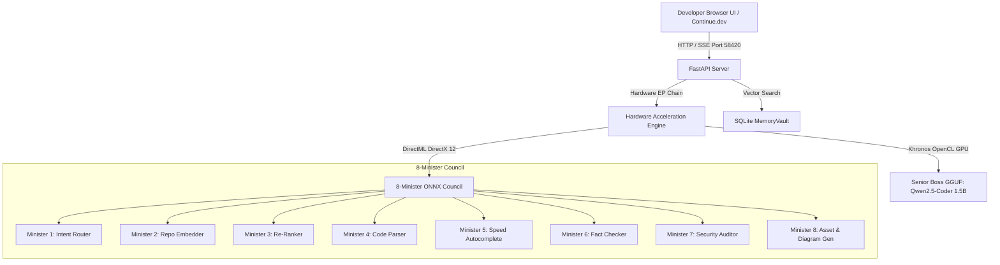

# 👑 Kingdom AI Server & Open WebUI

[](https://github.com/7CGPA-Labs/KingdomAIServer/actions/workflows/build.yml)
[](https://python.org)
[](LICENSE)
[](https://microsoft.com/windows)
[](http://127.0.0.1:58420)

**Kingdom AI Server** is a zero-admin, enterprise-secure local **OpenAI-Compatible AI Server & Open WebUI** for [Continue.dev](https://continue.dev) and local AI development.

It features a **Lightweight Browser-Based Open WebUI** served directly over `http://127.0.0.1:58420` alongside a developer-first CLI (`kingdom.cmd`). Running strictly in user space (`%LocalAppData%\KingdomAIServer\`), it eliminates PyInstaller binary `.exe` files entirely—bypassing corporate Windows Defender SmartScreen and AppLocker false positive blocks 100%.

---

## 🏛️ System Architecture



---

## ⚡ Dual Hardware Acceleration Engine

| Model Subsystem | Artifact Format | Primary Acceleration Provider | Target Silicon |
| :--- | :--- | :--- | :--- |
| **Senior Boss LLM** | `Qwen2.5-Coder-1.5B` (~1.1 GB GGUF) | **Khronos OpenCL (`CLBlast`)** (`n_gpu_layers=-1`, `offload_kqv=True`) | Intel Iris Xe / Arc / AMD / NVIDIA |
| **8-Minister Council** | 8 ONNX Models (~1.2 GB ONNX) | **DirectML (`onnxruntime-directml`)** (DirectX 12 Compute EUs) | DirectX 12 GPU / OpenVINO NPU |

---

## 🛡️ Windows Enterprise Security Guardrail Matrix

| Security Guardrail | Technical Implementation | Enterprise Security Impact |
| :--- | :--- | :--- |
| **Strict 127.0.0.1 Loopback Isolation** | Enforced in `security_guardrails_middleware` (`app.py`). Binds strictly to `127.0.0.1:58420` and rejects external IPs (`403 Forbidden`). | Prevents corporate LAN snooping & coworker port probing |
| **SSRF Informant Crawler Protection** | Pre-resolves DNS in `SSRFCrawler` (`crawler.py`). Blocks RFC 1918 private subnets (`10.0.0.0/8`, `172.16.0.0/12`, `192.168.0.0/16`), cloud metadata (`169.254.169.254`), and link-local IPs. | Prevents internal network reconnaissance proxies |
| **2 MB Payload & DirectML Watchdog** | Enforced via `security_guardrails_middleware` (`413 Payload Too Large`). Fixed KV Cache (4,096 tokens max). | Prevents VRAM exhaustion, desktop freezes & pagefile thrashing |
| **Parameterized Memory Persistence** | Parameterized SQL queries (`?`) in `MemoryVault` (`memory_vault.py`) across `session_history` and `cognitive_vectors`. | Prevents prompt injection & cognitive DB poisoning |
| **SSL / Certificate Handling** | Injected native `truststore` into Python SSL context across CLI, FastAPI server, and HTTP client. | Resolves Zscaler, BlueCoat, & corporate MITM proxy blocks |
| **Workspace Path Traversal Boundary** | Implemented **`WorkspacePathJail`** (`ministers.py`). Canonicalizes paths (`Path.resolve()`) and blocks traversal into `.ssh`, `.aws`, `.git`, `.gnupg`, `AppData\Roaming`, `C:\Windows`. | Jails RAG & AST code parsers strictly inside active workspace |
| **Zero-Admin User-Space Execution** | All paths (`models`, `logs`, `vault.db`, `venv`) bound strictly to `%LocalAppData%\KingdomAIServer\`. Zero UAC or Admin elevation required. | Bypasses AppLocker blocks, UAC prompts & EDR alerts |

---

## 🚀 Quick Start & Single-Line Installation

Run the non-admin installer script in PowerShell:

```powershell
irm https://raw.githubusercontent.com/7CGPA-Labs/KingdomAIServer/main/Deploy-KingdomServer.ps1 | iex
```

### Launch Server & Open WebUI:
```powershell
kingdom.cmd start
```
*Your default browser will automatically open to `http://127.0.0.1:58420` displaying the Kingdom AI Open WebUI.*

---

## 💻 CLI Command Matrix

```text
 ╔══════════════════════════════════════════════════════════════════════╗
 ║  👑 KINGDOM AI SERVER & OPEN WEBUI (Enterprise Edition) • v1.0.0     ║
 ║  Local OpenAI-Compatible Server for Continue.dev & Browser WebUI    ║
 ║  Status: ● ACTIVE  |  Endpoint: http://127.0.0.1:58420             ║
 ╚══════════════════════════════════════════════════════════════════════╝
```

| Command | Description |
| :--- | :--- |
| **`kingdom.cmd start`** | Starts the local server and automatically launches the Open WebUI browser app at `http://127.0.0.1:58420`. |
| **`kingdom.cmd ask "prompt"`** | Interacts directly with the **Ask Agent** (Conceptual explanations & domain insights). |
| **`kingdom.cmd plan "prompt"`** | Interacts directly with the **Plan Agent** (Step-by-step engineering implementation roadmaps). |
| **`kingdom.cmd code "prompt"`** | Interacts directly with the **Code Agent** (Clean, production-ready code generation). |
| **`kingdom.cmd sessions`** | Lists all saved conversation sessions from Cognitive Memory Vault (`memory.db`). Resume via `--session <id>`. |
| **`kingdom.cmd config`** | Auto-configures or repairs Continue.dev VS Code Extension configuration (`~/.continue/config.json`). |
| **`kingdom.cmd doctor`** | Runs pre-flight diagnostics for 9 model files, hardware drivers, port 58420, and Continue.dev config. |
| **`kingdom.cmd download`** | Thin-client downloader for missing model binaries (`--all`, `--model filename`). |
| **`kingdom.cmd stop`** | Gracefully stops any active background server process on port 58420. |
| **`kingdom.cmd logs`** | Streams server log output from `%LocalAppData%\KingdomAIServer\server.log`. |

---

## 🔌 Continue.dev VS Code Integration Guide

Run `kingdom.cmd config` or add the following to `~/.continue/config.json`:

```json
{
  "models": [
    {
      "title": "Kingdom AI Server (Qwen2.5-Coder)",
      "provider": "openai",
      "model": "qwen2.5-coder-1.5b",
      "apiBase": "http://127.0.0.1:58420/v1",
      "apiKey": "EMPTY"
    }
  ],
  "tabAutocompleteModel": {
    "title": "Kingdom Autocomplete (Granite 128M)",
    "provider": "openai",
    "model": "granite-code-128m",
    "apiBase": "http://127.0.0.1:58420/v1",
    "apiKey": "EMPTY"
  }
}
```

---

## 🧪 Verification & Testing

Run the full automated test suite (25 tests):

```powershell
.\venv\Scripts\python.exe -m pytest -v
```

---

## 📄 License

This project is licensed under the [MIT License](LICENSE).
