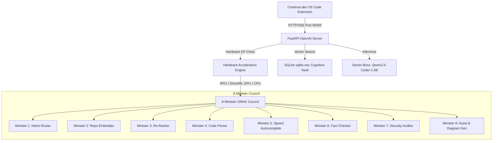

# 👑 Kingdom AI Server (`kingdom.exe`)

[](https://github.com/7CGPA-Labs/KingdomAIServer/actions/workflows/build.yml)
[](https://python.org)
[](LICENSE)
[](https://microsoft.com/windows)
[](http://127.0.0.1:58420)

**Kingdom AI Server** is a dedicated, zero-admin, local **OpenAI-Compatible AI Server for [Continue.dev](https://continue.dev)** (VS Code & JetBrains extension). It delivers a developer-first terminal CLI (modeled after modern AI agent CLIs like Google Antigravity / Claude Code) with optional background Windows System Tray integration (`pystray`), running strictly in user space (`%LocalAppData%\KingdomAIServer\`) on conflict-free loopback port `127.0.0.1:58420`.

---

## 🏛️ System Architecture



### Key Technical Specs

- **Main Inference Boss:** `Qwen2.5-Coder-1.5B-Instruct` (Q4_K_M GGUF format, ~1.1 GB) loaded via `llama-cpp-python` compiled with **DirectML / Vulkan** GPU acceleration with automatic AVX2 CPU fallback.
- **The 8-Minister Council:** `onnxruntime` with 3-tier cascading fallback: `[OpenVINO / QNN NPU -> DirectML (DirectX 12 GPU) -> CPU]`
- **Cognitive Memory & Persistence Backbone:** SQLite database (`%LocalAppData%\KingdomAIServer\vault.db`) running in WAL mode with `sqlite-vec` / 384-dim SIMD vector search.
- **SSRF Protection:** Async `httpx` client strictly blocking loopback (`127.0.0.1`, `::1`), RFC 1918 private subnets, and cloud metadata IPs (`169.254.169.254`).

---

## 🚀 Quick Start & Installation

### Option 1: Automated Non-Admin PowerShell Deployment

Download the release zip and run the non-admin installer script in PowerShell:

```powershell
.\Deploy-KingdomServer.ps1
```

### Option 2: Run directly via CLI

```powershell
kingdom serve --tray
```

---

## 💻 CLI Command Matrix

```text
 ╔══════════════════════════════════════════════════════════════════════╗
 ║  👑 KINGDOM AI SERVER (Enterprise Edition) • v1.0.0                  ║
 ║  Local OpenAI-Compatible Server for Continue.dev                     ║
 ║  Status: ● ACTIVE  |  Address: http://127.0.0.1:58420                ║
 ╚══════════════════════════════════════════════════════════════════════╝
```

| Command | Description |
| :--- | :--- |
| `kingdom serve` / `kingdom start` | Starts the server in foreground with live telemetry dashboard (`--daemon`, `--tray`, `--port 58420`, `--auto-download`). |
| `kingdom ask "prompt"` / `kingdom chat` | Runs a prompt directly from the CLI or launches interactive terminal REPL chat session. |
| `kingdom download` | Automatically downloads missing GGUF and ONNX model binaries from HuggingFace (`--all`, `--model filename`). |
| `kingdom status` | Queries `/health` and prints hardware metrics and active silicon tiers. |
| `kingdom doctor` | Runs pre-flight diagnostics for 9 model files, hardware drivers, port 58420, and Continue.dev config. |
| `kingdom stop` | Gracefully stops any active background daemon on port 58420. |
| `kingdom logs` | Streams log output from `%LocalAppData%\KingdomAIServer\server.log` (`--tail N`, `--follow`). |
| `kingdom vault` | Inspects vector memory statistics or resets stored cognitive memory (`--clear`, `--stats`). |

---

## 🔌 Continue.dev Integration Guide

Add the following configuration to your `~/.continue/config.json`:

```json
{
  "models": [
    {
      "title": "Kingdom AI Server (Qwen2.5-Coder)",
      "provider": "openai",
      "model": "qwen2.5-coder-1.5b",
      "apiBase": "http://127.0.0.1:58420/v1",
      "apiKey": "EMPTY"
    }
  ],
  "tabAutocompleteModel": {
    "title": "Kingdom Autocomplete (Granite 128M)",
    "provider": "openai",
    "model": "granite-code-128m",
    "apiBase": "http://127.0.0.1:58420/v1",
    "apiKey": "EMPTY"
  }
}
```

---

## 🧪 Testing

Run the full automated unit and integration test suite:

```bash
pytest -v
```

---

## 🛡️ Corporate Proxies (Zscaler) & SmartScreen Troubleshooting

### 1. Zscaler Proxy Blocking `.zip` Asset Downloads
If your enterprise network proxy (e.g. Zscaler) blocks downloading release archives (`KingdomServer-win64-full.zip`), `Deploy-KingdomServer.ps1` will automatically fall back to deploying via local source / git clone:

```powershell
# Run zero-admin installer with automatic Zscaler fallback
irm https://raw.githubusercontent.com/7CGPA-Labs/KingdomAIServer/main/Deploy-KingdomServer.ps1 | iex
```

### 2. Windows Defender SmartScreen / Antivirus Unblocking
If Windows Defender or SmartScreen flags `kingdom.exe` or `KingdomTray.exe` as un-signed / untrusted:
1. Open PowerShell and run:
   ```powershell
   Unblock-File -Path "$env:LOCALAPPDATA\KingdomAIServer\bin\*"
   ```
2. Or open File Explorer to `%LocalAppData%\KingdomAIServer\bin\`, right-click `kingdom.exe` > **Properties** > check **Unblock** at the bottom > click **Apply**.

---

## 📄 License

This project is licensed under the [MIT License](LICENSE).
