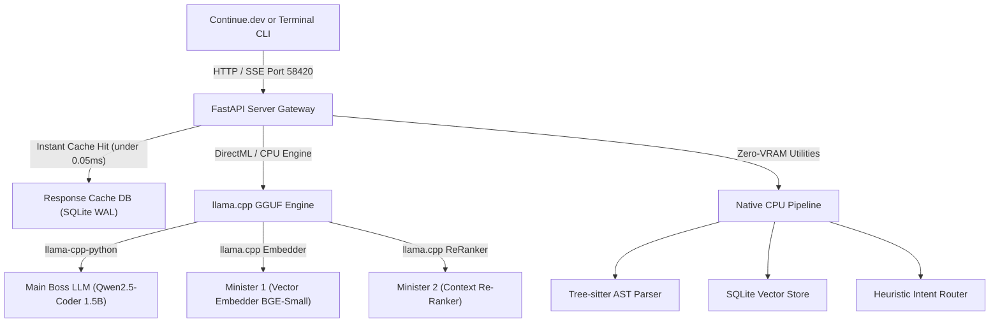

# 👑 Kingdom AI Server (V2 Headless)

[](https://github.com/7CGPA-Labs/KingdomAIServer/actions/workflows/build.yml)
[](https://python.org)
[](LICENSE)
[](https://microsoft.com/windows)
[](http://127.0.0.1:58420)
[](https://github.com/ggerganov/llama.cpp)
[](ARCHITECTURE_CHANGES_V2.md)

**Kingdom AI Server V2** is an ultra-lean, enterprise-secure local **OpenAI-Compatible AI Server** optimized explicitly for **Continue.dev** and local RAG workflows. 

V2 drops the bulky WebUI, operating completely headless from a single compiled **ZipApp (`.pyz`)**. It guarantees a strict **$\le 6.00$ GB VRAM static ceiling**, powered by `llama.cpp` (DirectML/OpenCL) and Qwen2.5-Coder.

---

## 🏗️ System Architecture (Lean 2-Minister Council)



---

## ⚡ Quick Start & Single-Line Installation

Kingdom V2 requires **zero Python setup**. It is distributed as an executable Python Zip archive (`kingdom.pyz`).

Run the non-admin installer script in PowerShell to download the engine:

```powershell
irm https://raw.githubusercontent.com/7CGPA-Labs/KingdomAIServer/v2.0.0/Deploy-KingdomServer.ps1 | iex
```

### 1. Download Model Weights
Run the model provisioner to securely pull GGUF weights directly from GitHub Releases:
```powershell
.\bin\download_models.cmd
```

### 2. Launch the CLI or Server
To use the rich **interactive terminal UI** (includes RAG capabilities):
```powershell
.\bin\kingdom_cli.cmd
```

To start the **background REST server** (for Continue.dev):
```powershell
.\bin\start_server.cmd
```

---

## 🧠 Standalone RAG CLI

The `kingdom_cli.cmd` now includes built-in semantic codebase indexing! You can index a project folder on your machine directly into the SQLite Vector Store using AST (Tree-Sitter) chunking.

From inside the CLI, type:
```bash
/index C:\Path\To\Your\Project
```
Once indexed, the server will automatically use **Minister 1 (Embedder)** and **Minister 2 (Re-Ranker)** to RAG-enrich your chat prompts behind the scenes.

---

## 🔌 Continue.dev VS Code Integration Guide

Add the following configuration to your `~/.continue/config.json`:

```json
{
  "models": [
    {
      "title": "Kingdom AI Server (Chat & Apply)",
      "provider": "openai",
      "model": "qwen2.5-coder-1.5b",
      "apiBase": "http://127.0.0.1:58420/v1",
      "apiKey": "local-token"
    },
    {
      "title": "Kingdom Editor (Ctrl+I)",
      "provider": "openai",
      "model": "qwen2.5-coder-1.5b",
      "apiBase": "http://127.0.0.1:58420/v1/edits",
      "apiKey": "local-token"
    }
  ],
  "tabAutocompleteModel": {
    "title": "Kingdom Autocomplete (Qwen2.5-Coder FIM)",
    "provider": "openai",
    "model": "qwen2.5-coder-1.5b",
    "apiBase": "http://127.0.0.1:58420/v1",
    "apiKey": "local-token"
  },
  "embeddingsProvider": {
    "provider": "openai",
    "model": "bge-small-en-v1.5",
    "apiBase": "http://127.0.0.1:58420/v1",
    "apiKey": "local-token"
  },
  "reranker": {
    "name": "cohere",
    "params": {
      "model": "bge-reranker-base",
      "apiBase": "http://127.0.0.1:58420/v1",
      "apiKey": "local-token"
    }
  },
  "rules": [
    "You are a surgical code editor. Never rewrite the entire file or output unmodified code. Only output the exact lines that changed, surrounded by strict Git-style diffs.",
    "Provide zero conversational filler. Do not explain the code unless explicitly asked. Output only the solution.",
    "Never hardcode API keys, passwords, or internal IP addresses. Always use environment variables."
  ]
}
```

---

## 🔌 Available REST API Endpoints

The server exposes strict OpenAI-compatible endpoints to integrate seamlessly with Continue.dev and other IDE plugins:

*   `POST /v1/chat/completions`: The core ChatML interface. Now fully supports OpenAI **Tool Calling** (`<tools>` and `<tool_call>`).
*   `POST /v1/completions`: High-speed Copilot-grade Fill-In-The-Middle (FIM) endpoint for Tab Autocomplete with zero-prefill KV caching and in-flight abort control.
*   `POST /v1/embeddings`: OpenAI-compatible embeddings endpoint used by Continue.dev (`embeddingsProvider`) to build local codebase indices via Minister 1 (BGE-Small).
*   `POST /v1/rerank`: Cohere-compatible reranking endpoint used to filter RAG context (`reranker`).
*   `POST /v1/edits`: OpenAI-compatible edit API for code mutation (`Ctrl+I` / `Cmd+I`).
*   `POST /v1/apply`: Custom endpoint for executing inline code application instructions.
*   `GET /`: Dynamic HTML server diagnostic and token status page.

---

## 🛡️ License

This project is licensed under the [MIT License](LICENSE).
