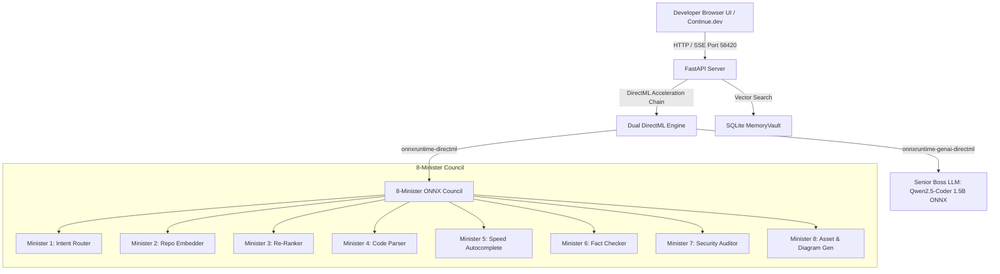

# 👑 Kingdom AI Server & Open WebUI

[](https://github.com/7CGPA-Labs/KingdomAIServer/actions/workflows/build.yml)
[](https://python.org)
[](LICENSE)
[](https://microsoft.com/windows)
[](http://127.0.0.1:58420)

**Kingdom AI Server** is a zero-admin, enterprise-secure local **OpenAI-Compatible AI Server & Open WebUI** for [Continue.dev](https://continue.dev) and local desktop AI development.

It features a **Lightweight Browser-Based Open WebUI** served directly over `http://127.0.0.1:58420`. The entire backend relies on a **100% ONNX DirectML Acceleration Engine**, running the Senior Boss model (`Qwen2.5-Coder-1.5B-Instruct`) via **`onnxruntime-genai-directml`** and the 8-Minister Council via **`onnxruntime-directml`**.

---

## 🏛️ System Architecture



---

## ⚡ Dual DirectML Hardware Acceleration Engine

| Model Subsystem | Artifact Format | Primary Acceleration Provider | Target Silicon |
| :--- | :--- | :--- | :--- |
| **Senior Boss LLM** | `Qwen2.5-Coder-1.5B-ONNX` (INT4 ONNX GenAI) | **`onnxruntime-genai-directml`** | Intel Iris Xe / Arc / AMD / NVIDIA |
| **8-Minister Council** | 8 ONNX Models (~1.2 GB ONNX) | **`onnxruntime-directml`** (DirectX 12 Compute EUs) | DirectX 12 GPU / OpenVINO NPU |

---

## 🚀 Quick Start & Single-Line Installation

Run the non-admin installer script in PowerShell:

```powershell
irm https://raw.githubusercontent.com/7CGPA-Labs/KingdomAIServer/main/Deploy-KingdomServer.ps1 | iex
```

### Launch Server & Open WebUI:

Start the server using pure Python:

```bash
python main.py
```
*Or alternatively:*
```bash
python start_server.py
```

*Your default browser will automatically open to `http://127.0.0.1:58420` displaying the Kingdom AI Open WebUI.*

---

## 🔌 Continue.dev VS Code Integration Guide

Add the following configuration to your `~/.continue/config.json`:

```json
{
  "models": [
    {
      "title": "Kingdom AI Server (Qwen2.5-Coder)",
      "provider": "openai",
      "model": "qwen2.5-coder-1.5b",
      "apiBase": "http://127.0.0.1:58420/v1",
      "apiKey": "EMPTY"
    }
  ],
  "tabAutocompleteModel": {
    "title": "Kingdom Autocomplete (Granite 128M)",
    "provider": "openai",
    "model": "granite-code-128m",
    "apiBase": "http://127.0.0.1:58420/v1",
    "apiKey": "EMPTY"
  }
}
```

---

## 🧪 Verification & Testing

Run the automated unit test suite:

```powershell
.\venv\Scripts\python.exe -m pytest -v
```

---

## 📄 License

This project is licensed under the [MIT License](LICENSE).
