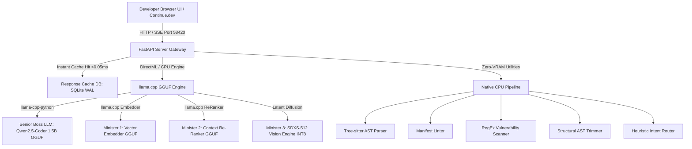

# 👑 Kingdom AI Server & Open WebUI

[](https://github.com/7CGPA-Labs/KingdomAIServer/actions/workflows/build.yml)
[](https://python.org)
[](LICENSE)
[](https://microsoft.com/windows)
[](http://127.0.0.1:58420)
[](https://github.com/ggerganov/llama.cpp)
[](ARCHITECTURE_CHANGES_V2.md)

**Kingdom AI Server V2** is a zero-admin, enterprise-secure local **OpenAI-Compatible AI Server & Open WebUI** built for [Continue.dev](https://continue.dev) and local desktop AI development.

It features a **Lightweight Browser-Based Open WebUI** served directly over `http://127.0.0.1:58420`. The V2 engine is powered by **`llama.cpp` GGUF runtime** (`llama-cpp-python`) with **DirectML hardware acceleration** and **CPU AVX2 fallback**, operating under a strict **$\le 1.48$ GB VRAM static ceiling** to eliminate DirectX 12 driver crash evictions (`DXGI_ERROR_DEVICE_REMOVED`).

---

## 🏛️ System Architecture



---

## ⚡ Hardware & Subsystem Allocation Matrix

| Subsystem | Model / Tool Component | Quantization / Spec | Acceleration Engine | VRAM / RAM Budget | Execution Latency |
| :--- | :--- | :--- | :--- | :--- | :--- |
| **Main Boss LLM** | `Qwen2.5-Coder-1.5B-Instruct` | Q4_K_M GGUF | `llama-cpp-python` (DirectML / CPU) | ~1.1 GB VRAM | 20–35 ms TTFT |
| **Response Cache DB** | SQLite WAL Cache (`data/cache/`) | In-Memory Hash + Disk | SQLite WAL Engine | 0 MB VRAM (<2 MB RAM) | **< 0.05 ms** |
| **Minister 1: Embedder** | `bge-small-en-v1.5` | GGUF (384-dim dense) | `llama.cpp` Vector Engine | ~35 MB VRAM / RAM | 4–8 ms |
| **Minister 2: Re-Ranker** | `bge-reranker-small` | GGUF Cross-Encoder | `llama.cpp` Re-Ranker Engine | ~110 MB VRAM / RAM | 10–16 ms |
| **Minister 3: Vision** | `SDXS-512-0.9-1step` | INT8 Latent Diffusion | DirectML / llama.cpp GGUF | ~230 MB VRAM / RAM | 40–90 ms |
| **Zero-VRAM Native Utilities** | Tree-sitter / Linter / RegEx | C-ABI Native Libraries | Native CPU Execution | **0 MB VRAM** (<5 MB RAM) | **< 1–3 ms** |

---

## 🚀 Quick Start & Single-Line Installation

Run the non-admin installer script in PowerShell:

```powershell
irm https://raw.githubusercontent.com/7CGPA-Labs/KingdomAIServer/main/Deploy-KingdomServer.ps1 | iex
```

### Launch Server & Open WebUI:

Start the server using pure Python:

```bash
python main.py
```
*Or alternatively:*
```bash
python start_server.py
```

*Your default browser will automatically open to `http://127.0.0.1:58420` displaying the Kingdom AI Open WebUI.*

---

## 🔌 Continue.dev VS Code Integration Guide

Add the following configuration to your `~/.continue/config.json`:

```json
{
  "models": [
    {
      "title": "Kingdom AI Server (Qwen2.5-Coder)",
      "provider": "openai",
      "model": "qwen2.5-coder-1.5b",
      "apiBase": "http://127.0.0.1:58420/v1",
      "apiKey": "EMPTY"
    }
  ],
  "tabAutocompleteModel": {
    "title": "Kingdom Autocomplete (Qwen2.5-Coder FIM)",
    "provider": "openai",
    "model": "qwen2.5-coder-1.5b",
    "apiBase": "http://127.0.0.1:58420/v1",
    "apiKey": "EMPTY"
  }
}
```

---

## 🧪 Verification & Testing

Run the automated 4-Gate diagnostic verification test suite (68/68 passing tests):

```powershell
.\venv\Scripts\python.exe -m pytest -v
```

---

## 📄 License

This project is licensed under the [MIT License](LICENSE).
