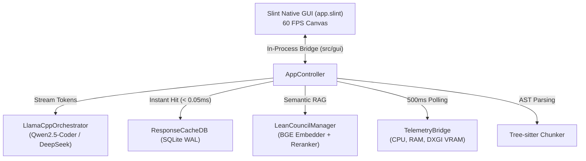

# 👑 Kingdom AI Studio V3 (Google Antigravity Clone)

[](https://github.com/7CGPA-Labs/KingdomAIServer/actions/workflows/build.yml)
[](https://python.org)
[](LICENSE)
[](https://microsoft.com/windows)
[](https://slint.dev)
[](https://github.com/ggerganov/llama.cpp)
[](v3-architecture.md)

**Kingdom AI Studio V3** is an on-device, zero-server standalone **AI Programming Studio** — designed as a native desktop clone of **Google Antigravity GUI** using the **Slint GUI library**.

V3 decommissions the HTTP REST daemon requirement. It executes **100% in-process** directly against the local `llama.cpp` engine, BGE Embedder/Reranker Council, and SQLite WAL cache with an ultra-light on-device memory footprint (< 30 MB RAM) and a guaranteed strict **$\le 6.00$ GB VRAM safety ceiling**.

---

## 🎨 Antigravity GUI Interface Layout

Kingdom AI Studio V3 features the complete 4-surface Google Antigravity developer layout:

1. **Left Navigation Sidebar (`src/gui/ui/sidebar.slint`)**: Workspace switcher, navigation tabs (Chat, Models Hub, K-Top, Settings), and pair programming session history.
2. **Center Chat & Prompt Canvas (`src/gui/ui/chat_canvas.slint`)**: 60 FPS multi-turn streaming message bubbles, inline syntax-styled code cards, and a floating `/` slash command palette.
3. **Right Auxiliary Dock (`src/gui/ui/auxiliary_pane.slint`)**: Real-time status for the Council Ministers (Main Boss, Minister 1 Embedder, Minister 2 Reranker, Tree-Sitter AST), hardware bar gauges, and SQLite WAL cache inspector.
4. **Persistent Status Bar (`src/gui/ui/app.slint`)**: Live hardware indicators, token generation speed, and compute silicon engine badges (Vulkan / Intel Iris Xe / CUDA / CPU AVX2).


```mermaid
graph TD
    UI["Slint Native GUI (app.slint)<br/>60 FPS Canvas"] <-->|"In-Process Bridge (src/gui)"| Ctrl["AppController"]
    Ctrl -->|"Stream Tokens"| LLM["LlamaCppOrchestrator<br/>(Qwen2.5-Coder / DeepSeek)"]
    Ctrl -->|"Instant Hit (< 0.05ms)"| Cache["ResponseCacheDB (SQLite WAL)"]
    Ctrl -->|"Semantic RAG"| Council["LeanCouncilManager<br/>(BGE Embedder + Reranker)"]
    Ctrl -->|"500ms Polling"| Telem["TelemetryBridge<br/>(CPU, RAM, DXGI VRAM)"]
    Ctrl -->|"AST Parsing"| AST["Tree-sitter Chunker"]
```

---

## ⚡ Quick Start & Installation

Kingdom V3 is distributed as an executable Python Zip archive (`kingdom.pyz`) and desktop wrapper.

Run the one-line installer in PowerShell:

```powershell
irm https://raw.githubusercontent.com/7CGPA-Labs/KingdomAIServer/main/Deploy-KingdomServer.ps1 | iex
```

### 1. Launch Kingdom AI Studio Desktop GUI
Run the native desktop application:
```powershell
python main.py
```
Or double-click the **Kingdom AI Studio** shortcut created on your desktop (or `.\bin\kingdom_studio.cmd`).

### 2. Available Slash Commands
From the studio prompt box, type `/` to open the command palette:
* `/top`: Switch to full-screen K-Top hardware & throughput telemetry dashboard.
* `/models`: Open Models Hub to view, download, and switch models.
* `/cache`: Inspect SQLite WAL zero-VRAM response cache statistics.
* `/clearcache`: Purge cached prompt completions.
* `/health`: Run diagnostics and view system compute health.
* `/clear`: Clear conversation history.
* `/help`: Display studio guide and command list.
* `/switch <model_id>`: Dynamically switch active model weights in-process.
* `/download <model_id>`: Download weights from HuggingFace directly in the background.

---

## 📦 Supported Model Catalog

Kingdom AI Studio V3 provides instant one-click switching and downloading for:
| Model ID | Base Architecture | Approx Size | VRAM Budget | Primary Role |
| :--- | :--- | :--- | :--- | :--- |
| `qwen2.5-coder-1.5b` | Qwen 2.5 Coder 1.5B (Q4_K_M) | 1.1 GB | ~1.1 GB | Default Senior Software Engineer (Fast & Lean) |
| `qwen2.5-coder-3b` | Qwen 2.5 Coder 3B (Q4_K_M) | 2.0 GB | ~2.9 GB | Balanced high-performance coding model |
| `qwen3-coder-1.7b` | Qwen 3 Coder 1.7B (Q4_K_M) | 1.25 GB | ~1.8 GB | Next-gen ultra-fast agentic coding model |
| `qwen3-coder-4b` | Qwen 3 Coder 4B (Q4_K_M) | 2.8 GB | ~4.2 GB | Advanced reasoning & repo-scale architect |
| `deepseek-coder-1.3b` | DeepSeek Coder 1.3B (Q4_K_M) | 0.95 GB | ~1.05 GB | Ultra-lightweight multi-language coding engine |

---

## 🔌 Legacy Headless Server & Continue.dev (Optional)

If you still need the background HTTP/OpenAI server for IDE extensions (e.g., Continue.dev):
```powershell
python main.py --server
```

Configuration for `~/.continue/config.json`:
```json
{
  "models": [
    {
      "title": "Kingdom AI Studio (Chat & Apply)",
      "provider": "openai",
      "model": "qwen2.5-coder-1.5b",
      "apiBase": "http://127.0.0.1:58420/v1",
      "apiKey": "local-token"
    }
  ],
  "embeddingsProvider": {
    "provider": "openai",
    "model": "bge-small-en-v1.5",
    "apiBase": "http://127.0.0.1:58420/v1",
    "apiKey": "local-token"
  }
}
```

---

## 🧪 Running Tests

Verify the entire test suite (100 tests):
```powershell
pytest -v
```

---

## 🛡️ License

This project is licensed under the [MIT License](LICENSE).
