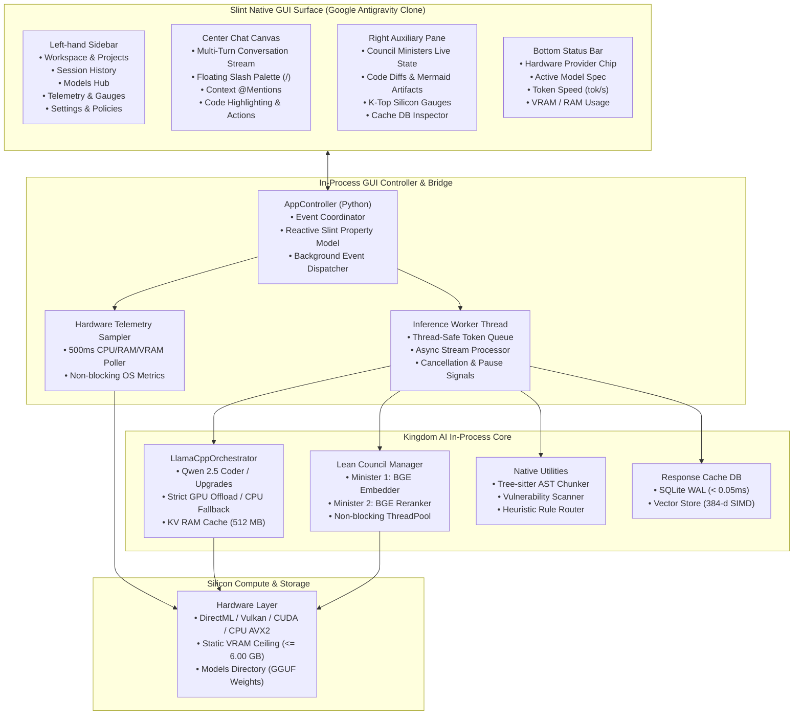

# Kingdom AI Studio V3 - Architecture Specification
## Evolution from Headless Server to Google Antigravity Desktop GUI (Powered by Slint)

---

## 1. Executive Summary & Vision

**Kingdom AI V3** marks a fundamental architectural paradigm shift: **transitioning from a headless HTTP REST server (V1/V2) to a standalone, zero-network desktop AI studio modeled after Google Antigravity GUI**.

In V2, the application operated as a headless Uvicorn/FastAPI backend paired with a Rich Terminal CLI and K-Top dashboard. While robust, the client-server HTTP abstraction introduced unnecessary serialization latency, socket port management, firewall prompts, and network security surface area for a tool designed to run 100% locally.

**In V3, the server layer is completely decommissioned.** The entire engine runs in-process, driven by a modern, high-performance, native GUI built with **[Slint](https://slint.dev/)**. All TUI monitoring features, model managers, cache viewers, and CLI commands are promoted to rich visual controls, interactive panels, and floating command palettes.

```
┌──────────────────────────────────────────────────────────────────────────┐
│                             KINGDOM AI V3                                │
│                     (Google Antigravity GUI Clone)                       │
├────────────────────────────────┬─────────────────────────────────────────┤
│          V2 Legacy             │               V3 Studio                 │
├────────────────────────────────┼─────────────────────────────────────────┤
│ • Headless FastAPI / Uvicorn   │ • 100% In-Process Slint Desktop GUI     │
│ • Localhost HTTP Port 58420    │ • Zero Network Sockets / Zero Overhead  │
│ • Bearer Token Auth Middleware │ • Direct Python Memory Threading        │
│ • Terminal CLI (Rich TUI)      │ • Multi-Panel Declarative Slint UI      │
│ • K-Top Text Console Monitor   │ • Animated Hardware Telemetry Meters    │
│ • Manual /command CLI typing   │ • Floating Slash Command Palette (/)    │
│ • Plain Text Stream Output     │ • Styled Code Blocks, Diffs & Artifacts │
└────────────────────────────────┴─────────────────────────────────────────┘
```

---

## 2. Why Slint GUI Toolkit?

[Slint](https://slint.dev/) was selected over Electron, Qt/PySide, and Tkinter for several critical technical reasons:

1. **Ultra-Low Memory Footprint (< 30 MB RAM):**  
   Unlike Electron (which runs a full Chromium browser consuming 200MB–400MB of RAM), Slint compiles into lean native code. For an on-device AI system constrained to a strict $\le 6.00\text{ GB}$ VRAM/RAM ceiling, preserving every megabyte for model weights and KV cache is vital.

2. **Native GPU Acceleration (DirectX / Vulkan / Skia / OpenGL):**  
   Slint renders directly to native graphics surfaces at 60+ FPS, providing buttery-smooth streaming text, animated resource meters, and fluid panel transitions without CPU rendering overhead.

3. **Declarative Syntax with Python Two-Way Bindings:**  
   Slint cleanly decouples interface definition (`.slint` files) from application logic. The Python SDK (`slint`) exposes reactive properties, list models, and thread-safe callbacks (`slint.invoke_from_event_loop`), allowing Python worker threads to push streaming tokens directly to UI elements.

4. **Cross-Platform Single Binary Distribution:**  
   Slint builds seamlessly into standalone Windows executables without requiring external browser runtimes or heavy framework DLLs.

---

## 3. High-Level Architectural Diagram



---

## 4. Decommissioning the Server Layer

V3 eliminates all server-specific networking code. The table below outlines what will be removed and what replaces it:

| Component | V2 Legacy (Server) | V3 Studio (In-Process GUI) | Rationale |
| :--- | :--- | :--- | :--- |
| **Network Framework** | FastAPI + Uvicorn | Direct In-Process Function Calls | Eliminates TCP stack latency, port conflicts (58420), and firewall prompts. |
| **Endpoints** | `/v1/chat/completions`, `/v1/edits`, `/v1/apply`, `/v1/rerank` | Direct Python method invocations on `LlamaCppOrchestrator` & `LeanCouncilManager` | In-process execution reduces overhead from ~15ms HTTP transport to < 0.1ms direct call. |
| **Authentication** | Bearer Token & CSPA Origin validation | OS user-space execution isolation | Local desktop apps do not require token-authenticated localhost loopback HTTP requests. |
| **Streaming Protocol**| Server-Sent Events (`text/event-stream`) | Slint Thread-Safe Event Callback (`slint.invoke_from_event_loop`) | UI receives tokens directly into native text components as they are generated. |
| **Security Middleware**| SSRF IP validation, Payload size limits | Local workspace sandbox & Tree-sitter AST sanitization | Security shifts from network filtering to AST code validation and workspace path jailing. |

---

## 5. UI Layout & Antigravity Feature Mapping

The interface is structured into four primary surfaces replicating Google Antigravity's ergonomic layout:

```
┌──────┬──────────────────────────────────────────┬────────────────────────┐
│ [≡]  │  👑 Kingdom AI Studio - Active: Qwen 2.5 │  🏛️ Council Ministers  │
├──────┼──────────────────────────────────────────┼────────────────────────┤
│ 💬   │                                          │ • Boss: Qwen 2.5 [●]   │
│ Chat │  User: Fix the bug in auth.py            │ • Min 1: Embedder [●]  │
│      │  ──────────────────────────────────────  │ • Min 2: Reranker [●]  │
│ 📁   │  Kingdom Assistant:                      │ • AST: Tree-sitter [●] │
│ Work-│  Here is the corrected implementation:   ├────────────────────────┤
│ space│  ┌─────────────────────────────────────┐ │  💻 K-Top Telemetry   │
│      │  │ def authenticate(token: str):       │ │ CPU:  [████░░░] 42%    │
│ 📦   │  │     return verify_token(token)      │ │ RAM:  [██████░] 6.8 GB │
│ Mod- │  │                                     │ │ VRAM: [███░░░░] 2.1 GB │
│ els  │  └─────────────────────────────────────┘ ├────────────────────────┤
│      │                                          │  ⚡ Response Cache     │
│ 📊   │  ──────────────────────────────────────  │ Hits: 18/24 (75.0%)    │
│ K-Top│  [ /commands... or type a message ]  [^] │ Latency: < 0.05 ms     │
├──────┴──────────────────────────────────────────┴────────────────────────┤
│ ⚡ Vulkan GPU (Intel Iris Xe) | VRAM: 2.14 / 6.00 GB | Speed: 34.2 tok/s  │
└──────────────────────────────────────────────────────────────────────────┘
```

### 5.1 Left-hand Navigation Sidebar
* **💬 Chats & Sessions:** Manage active and historical conversation threads with instant restore from disk.
* **📁 Workspace & File Tree:** Select active project folder; displays indexed code files, Tree-sitter AST parsed status, and symbols.
* **📦 Models Hub:** Visual card gallery of Boss models (Qwen2.5 1.5B/3B/7B, DeepSeek Coder) with disk sizes, one-click HuggingFace downloads with live progress bars, and hot-swap buttons.
* **📊 K-Top Dashboard View:** Expanded full-page system telemetry view for deep performance profiling.
* **⚙️ Settings & Execution Policies:** Toggle GPU offload mode (Strict GPU vs CPU Multi-thread), VRAM budget limit slider (up to 6.00 GB ceiling), and tool execution sandbox modes (`always-proceed`, `request-review`).

### 5.2 Center Chat Canvas
* **Multi-Turn Message Stream:** Markdown rendering with syntax-highlighted code blocks, copy-to-clipboard buttons, and "Apply to Workspace" shortcuts.
* **Floating Slash Command Palette (`/`):** Triggered when typing `/` in the prompt input. Promotes all former CLI commands to graphical interactive overlays:
  * `/top` — Opens the live K-Top Telemetry Inspector.
  * `/models` — Opens the Model Management Hub.
  * `/download <model>` — Opens model downloader modal.
  * `/switch <model>` — Triggers hot-swap with pre-flight VRAM check.
  * `/health` — Opens Silicon Diagnostics Drawer.
  * `/cache` & `/clearcache` — Inspects and purges the SQLite WAL response cache.
  * `/index <dir>` — Selects and indexes a workspace into the vector store.
  * `/audit` — Runs native Tree-sitter AST vulnerability scan.
  * `/clear` — Clears conversation canvas.
* **Context Mentions (`@`):** Type `@` to attach project context directly into the prompt (e.g. `@file`, `@workspace`, `@terminal`).

### 5.3 Right Auxiliary Inspector (Collapsible & Dockable)
* **Tab 1: Council Ministers State:** Visual status badges for Boss LLM, Minister 1 (BGE Embedder 384-d), Minister 2 (BGE Reranker), and Tree-Sitter Parser.
* **Tab 2: Code Diffs & Mermaid Artifacts:** Side-by-side or unified diff realigner for multi-file patches; interactive Mermaid diagram renderer.
* **Tab 3: K-Top Telemetry Gauges:** Real-time animated progress bars for CPU utilization %, RAM usage, and resident VRAM against the static 6.00 GB ceiling.
* **Tab 4: Response Cache DB:** SQLite WAL metrics, hit counter, hit ratio %, and prompt pattern inspector.

### 5.4 Bottom Status Bar
* **Compute Engine:** Silicon provider chip (e.g. `Vulkan GPU (Intel Iris Xe)` / `CUDA GPU (RTX 4070)` / `CPU AVX2 (Intel Xeon)`).
* **VRAM Ceiling:** Live resident allocation vs budget (e.g. `2.14 / 6.00 GB [PASSED]`).
* **Generation Throughput:** Real-time generation speed (`tokens/sec`) and Time-To-First-Token (TTFT).
* **Workspace Status:** Active workspace root directory name and indexing state.

---

## 6. Directory Layout for V3

```
KingdomAIServer/
├── v3-architecture.md             # This comprehensive architecture document
├── pyproject.toml                 # Updated dependencies (adds slint, removes uvicorn/fastapi)
├── requirements.txt               # Updated requirements list
├── main.py                        # V3 Entrypoint (boots Slint GUI application)
├── src/
│   ├── gui/                       # Unified Desktop GUI Architecture
│   │   ├── __init__.py
│   │   ├── app_controller.py      # Master Slint Python controller
│   │   ├── worker.py              # Background LLM streaming thread worker
│   │   ├── telemetry_bridge.py    # Periodic poller pushing metrics to Slint
│   │   ├── models_adapter.py      # Adapts UPGRADE_MODELS catalog to Slint models
│   │   └── ui/                    # Slint Declarative UI Component Tree
│   │       ├── app.slint          # Master window definition & shell layout
│   │       ├── theme.slint        # Antigravity Dark Theme (Slate/Cyan/Magenta palette)
│   │       ├── sidebar.slint      # Left navigation sidebar & project switcher
│   │       ├── chat_canvas.slint  # Chat message stream, prompt input, slash popup
│   │       ├── auxiliary_pane.slint # Right dock: Council status, Diffs, Artifacts
│   │       ├── ktop_panel.slint   # Real-time resource gauges & telemetry meters
│   │       ├── models_hub.slint   # Visual model catalog, downloader & switcher
│   │       ├── settings_modal.slint # Settings and configurations dialog
│   │       ├── tasks_panel.slint  # Scheduled tasks & background operations
│   │       ├── skills_panel.slint # Extensible agent skills manager
│   │       ├── projects_panel.slint # Active workspace project explorer
│   │       └── components/        # Reusable Slint UI widgets
│   │           ├── progress_meter.slint # Custom animated bar gauge
│   │           ├── badge.slint    # Status indicator badge (Active/Standby/Missing)
│   │           ├── code_card.slint # Syntax-styled code container with copy button
│   │           └── icon.slint     # SVG vector icon registry
│   │
│   ├── core/                      # Direct In-Process Inference Core (Preserved & Enhanced)
│   │   ├── local_llm.py           # LlamaCppOrchestrator (GGUF weights & generation)
│   │   ├── council.py             # LeanCouncilManager (Embedder + Reranker pipeline)
│   │   ├── hardware.py            # HardwareManager & static 6GB VRAM budget
│   │   └── ministers.py           # Council minister definitions
│   │
│   ├── processing/                # Context & Memory Core
│   │   ├── cache.py               # SQLite WAL response cache
│   │   ├── chunking.py            # Tree-sitter AST structural chunker
│   │   └── preprocessor.py        # Intent routing & context trimming
│   │
│   ├── rag/                       # Local RAG Knowledge Vault
│   │   ├── embedder.py            # BGE Embedder (384-dimensional)
│   │   ├── retriever.py           # BGE Reranker
│   │   └── vector_store.py        # Vector similarity store
│   │
│   ├── prompts/                   # Prompt Templates & Roles
│   │   ├── templates.py           # ChatML formatting & heuristic router
│   │   └── roles/                 # Council minister persona files
│   │
│   └── utils/                     # System Utilities
│       ├── telemetry.py           # Native Windows DXGI, CPU & RAM sampling
│       ├── downloader.py          # HuggingFace chunked downloader with callbacks
│       └── verifier.py            # GGUF model manifest verifier
│
├── config/
│   └── model_config.yaml          # Model & hardware profile configuration
│
└── tests/
    ├── test_v1.py                 # Core unit tests (AST, tokenizer, verifier)
    ├── test_v2.py                 # Engine & dynamic telemetry integration tests
    └── test_v3.py                 # V3 Slint GUI controller & state bridge tests
```

---

## 7. Threading, Concurrency & Slint Integration

Slint operates on a dedicated UI event loop running on the main operating system thread. Because LLM generation and vector embedding are computationally intensive, **blocking the Slint thread causes UI stutter**. 

V3 uses a clean asynchronous multi-threaded bridge:

```
 ┌──────────────────────────────────────────────────────────────┐
 │                      Main OS Thread                          │
 │                                                              │
 │   Slint Event Loop (app.slint)                               │
 │   • Renders UI at 60 FPS                                     │
 │   • Captures User Keystrokes & Clicks                        │
 │   • Reads Reactive Properties:                               │
 │       chat_history, streaming_text, cpu_pct, vram_used       │
 └───────────────────────▲──────────────────────────────────────┘
                         │
        slint.invoke_from_event_loop(callback)
                         │
 ┌───────────────────────┴──────────────────────────────────────┐
 │                  Background Worker Threads                   │
 │                                                              │
 │  1. Inference Worker Thread:                                 │
 │     • Calls orchestrator.generate_stream(prompt)             │
 │     • For each token: invokes UI update callback             │
 │     • Dispatches AST chunking & vector search                │
 │                                                              │
 │  2. Telemetry Polling Thread (500ms):                        │
 │     • Samples HardwareTelemetry.snapshot()                   │
 │     • Pushes cpu_percent, ram_percent, vram_used to Slint    │
 │                                                              │
 │  3. Model Download Thread:                                   │
 │     • Downloads GGUF weights via requests stream             │
 │     • Pushes percentage progress to Slint download modal     │
 └──────────────────────────────────────────────────────────────┘
```

### Code Pattern for Thread-Safe Slint Property Updates
```python
import slint
import threading
from src.core.local_llm import LlamaCppOrchestrator

class SlintBridge:
    def __init__(self, ui_handle):
        self.ui = ui_handle
        self.orchestrator = LlamaCppOrchestrator()

    def on_user_send_message(self, prompt: str):
        # Kick off generation in background thread to prevent UI freezing
        threading.Thread(target=self._run_inference, args=(prompt,), daemon=True).start()

    def _run_inference(self, prompt: str):
        # 1. Update UI state: generating = True
        slint.invoke_from_event_loop(lambda: setattr(self.ui, "is_generating", True))

        # 2. Stream tokens from in-process LLM
        stream = self.orchestrator.generate_stream(prompt)
        accumulated_text = ""
        for token in stream:
            accumulated_text += token
            # Safely post token into Slint UI state
            current_chunk = accumulated_text
            slint.invoke_from_event_loop(lambda: self.ui.append_token(current_chunk))

        # 3. Finalize generation
        slint.invoke_from_event_loop(lambda: setattr(self.ui, "is_generating", False))
```

---

## 8. Migration Plan & Step-by-Step Roadmap

### Phase 1: Dependency & Environment Preparation
1. Add `slint` to `pyproject.toml` and `requirements.txt`.
2. Remove server dependencies: `uvicorn`, `fastapi`, `starlette`.
3. Verify local Python environment can compile and display a basic Slint preview window.

### Phase 2: Slint Markup & Theme Implementation (`src/gui/ui/`)
1. Create `src/gui/ui/theme.slint`: Define color tokens (Slate dark background, Accent cyan, Magenta, emerald green).
2. Create `src/gui/ui/components/`: Reusable bar meters, minister badges, code cards.
3. Build `src/gui/ui/sidebar.slint`: Workspaces, conversations, models, and telemetry tabs.
4. Build `src/gui/ui/chat_canvas.slint`: Scrollable conversation list, prompt input box, floating `/` popup menu.
5. Build `src/gui/ui/auxiliary_pane.slint`: Council ministers status, live K-Top hardware gauges, cache DB inspector, diff viewer.
6. Assemble `src/gui/ui/app.slint`: Integrate all panels into the master window shell.

### Phase 3: GUI Application Controller (`src/gui/`)
1. Implement `AppController` in `src/gui/app_controller.py`:
   * Load `src/gui/ui/app.slint`.
   * Bind prompt submission callback.
   * Bind slash command actions (`/top`, `/models`, `/switch`, `/health`, etc.).
   * Bind workspace folder picker dialog.
2. Implement `worker.py`: Background worker for non-blocking token streaming and cancellation.
3. Implement `telemetry_bridge.py`: Poll `HardwareTelemetry` every 500ms and push CPU, RAM, and VRAM directly to Slint properties.
4. Implement `models_adapter.py`: Populate Slint model hub list with installed sizes and available models.

### Phase 4: Server Decommissioning & Legacy Cleanup
1. Deprecate `src/inference/inference_engine.py` and `src/utils/auth.py`.
2. Refactor `main.py` to directly instantiate and launch the Slint GUI application (`AppController().run()`).
3. Update `config/model_config.yaml` to remove server port/host fields while preserving hardware budget limits.

### Phase 5: Verification, Packaging & Deployment
1. Implement `tests/test_v3.py` to test GUI controller initialization, mock token streaming, and property updates.
2. Update `build/package_release.py` to bundle Slint assets and compiled components.
3. Update `Deploy-KingdomServer.ps1` to create desktop shortcut for `KingdomStudio.exe` or `kingdom.cmd` launching the Slint GUI.

---

## 9. Conclusion

Kingdom AI Studio V3 transforms Kingdom from an API daemon into a premier, self-contained AI programming studio. By leveraging Slint, V3 delivers the responsive developer experience of **Google Antigravity GUI** with an on-device footprint of under 30 MB RAM and guaranteed $\le 6.00\text{ GB}$ VRAM execution.
